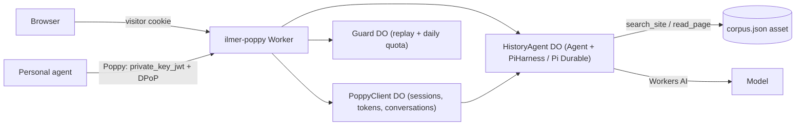

# Ilmer Past history agent

An AI archive assistant for Ilmer Past, served at **<https://poppy.ilmer.org>**. It answers questions about Ilmer's history from the pages of this website, and cites the pages it used.

People use the chat page at `/`. Other people's personal AI agents can talk to it through the [Poppy](https://github.com/irvinebroque/poppy-demo) Personal Agent Protocol (draft 0.1), starting from `/.well-known/poppy.json`.

## How it works



- **Pi Durable agent** (`src/agent.ts`). Each website visitor and each Poppy conversation gets its own `HistoryAgent` Durable Object. Each one runs Pi through the Agents SDK's `PiHarness`. Prompts are submitted durably, so a run survives the object being evicted. The agent has two read-only tools:
  - `search_site`: BM25 search over the site.
  - `read_page`: reads one page in windows of up to 8,000 characters.
- **Knowledge.** `scripts/build-corpus.mjs` takes the `<main>` text of every built page in `../_site`, so URLs match the live site exactly. The result is written to `public/corpus.json` (by a Vite plugin in `vite.config.ts`), which the Worker reads through its assets binding. It is not served publicly. The corpus is rebuilt on every deploy; set `CORPUS_REBUILD_SITE=true` to rebuild `_site` first.
- **Poppy receiver** (`src/poppy.ts`, `src/state.ts`). Any personal agent can connect:
  - Its `client_id` is an HTTPS URL to its client metadata.
  - It authenticates with `private_key_jwt` (ES256) and gets a DPoP-bound Session Token through the JWT bearer grant.
  - Ilmer Past has no user accounts, so there is no sign-in, authorization endpoint or refresh token. Sessions are signed out only.
  - Conversation endpoints: `POST /poppy/conversations`, `POST …/{id}/messages`, `GET …/{id}/events`, `POST …/{id}/handoff`, `POST …/{id}/close`. Add `?wait=1` to wait up to 25 seconds for the answer.
- **Chat UI** (`client/`). Adapted from Cloudflare's Pi harness example (MIT, see `licenses/`), using Kumo components in the Ilmer Past palette. It polls Pi's session snapshot through cookie-scoped endpoints.

## Develop

The `cf` CLI builds and runs the Worker through `@cloudflare/vite-plugin` (v2), which reads `cloudflare.config.ts`. `vite build` produces the Build Output in `.cloudflare/output` that `cf deploy` uploads.

Requires Node.js 22+ and a Cloudflare account with Workers AI.

```bash
cd agent
npm install
npx cf auth login
npm run dev                              # http://localhost:8787
ILMER_POPPY_OFFLINE=true npm run dev     # no Cloudflare login: everything but model answers
```

```bash
npm run check                                     # typecheck worker and client
npm test                                          # corpus unit tests
POPPY_E2E_ORIGIN=http://localhost:8787 npm test   # plus Poppy end-to-end tests against dev
```

The end-to-end tests act as a third-party personal agent. They cover discovery, the token flow, DPoP binding and replay, message idempotency, close, and revocation.

## Deploy

The Worker is deployed with the `cf` CLI. Its custom domain is managed in the `cf-config` repository (`modules/ilmer-org`), alongside the rest of the `ilmer.org` DNS.

1. `cd agent && npm run deploy:dry-run` to build and check the bundle.
2. `npm run deploy` to deploy the `ilmer-poppy` Worker. `workers.dev` is disabled, so it is not reachable yet.
3. In `cf-config`, apply the `cloudflare_workers_custom_domain.poppy` resource. This creates the `poppy.ilmer.org` DNS record and certificate. The API token needs Zone:Workers Routes:Edit.

Redeploy whenever the site's content changes, so that the agent's corpus stays current.

## Configuration

Set these environment variables when running `npm run deploy` or `npm run dev`. They are read by `cloudflare.config.ts`.

| Variable                         | Default                     | Purpose                                            |
| -------------------------------- | --------------------------- | -------------------------------------------------- |
| `ILMER_POPPY_MODEL`              | `@cf/zai-org/glm-5.3-flash` | Workers AI model                                   |
| `ILMER_POPPY_DAILY_PROMPT_LIMIT` | `500`                       | Prompts per UTC day across all visitors and agents |
| `ILMER_POPPY_OFFLINE`            | unset                       | `true` omits Workers AI for credential-free dev    |

The daily limit caps Workers AI spend, because the page is public and anonymous. Visitors see a friendly message once it is reached.
